# bpSRF: An extra robotic finger powered by wrist movements
 Github site for the bpSRF, a body-powered supernumerary robotic finger for hand augmentation that requires no electronic components.
## Project Overview
This guide introduces the assembly and operation of the **Body-Powered Supernumerary Robotic Finger (bpSRF)**. The bpSRF is an lightweight device designed to enhance users' grasping capabilities by controlling an additional robotic finger using wrist movements. Unlike conventional SRFs, the bpSRF eliminates the need for electronic components and relies solely on body-powered mechanisms. 
The device is particularly suited for helping people with hand impairments that limit finger but not wrist movements. It is also an excellent tool for healthy individuals seeking to explore additional degrees of freedom and novel hand grasping patterns. The bpSRF is easily manufacturable using 3D printing, making it a cost-effective and replicable solution.

<p align="center">
  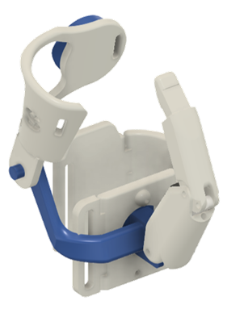
</p>

Here are some examples on how it can be used:

<p align="center">
  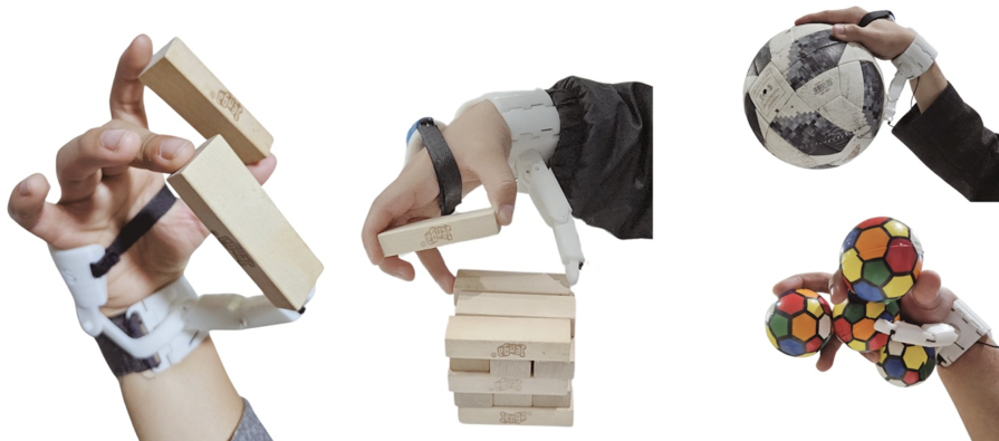
</p>

## Folder structure
The STL files are organized into folders as follows:
- **Finger**
    * Proximal phalanx
    * Distal phalanx
    * Inner link
- **Wrist**
    * Wrist side brace 1
    * Wrist side brace 2
    * Wrist buckle
    * Wrist posterior brace
    * Wrist anterior brace + driving link (in one part)
    * Shaft collar
- **Palm support**
    * Available in S, M and L sizes
- **Cable tensioner**
- **Fingertip**
    * Fingertip mold part 1
    * Fingertip mold part 2
    * Fingertip mold base

These last fingertip files are optional. They can be used in case you wish to add a silicon rubber fingertip to the bpSRF. These parts were designed as a mold in which liquid silicon rubber can be poured. The resulting silicon rubber fingertip perfectly matches the shape of the bpSRFs distal phalanx.

The following figure shows the different components of the bpSRF. Although not shown, the finger's inner link is inside the proximal phalanx and will be shown in the assembly guide.


<p align="center">
  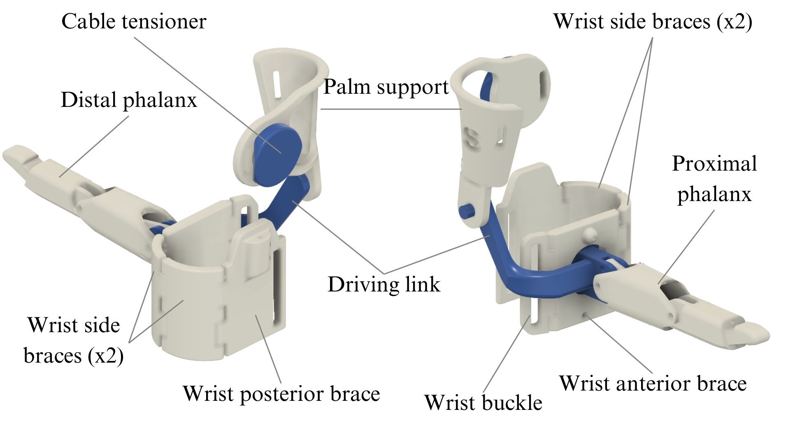
</p>

Each folder contains the parts required for printing. Please print one piece from each file in the respective folders.

## Getting Started
### Download the Files
Clone the repository or download the zip file to access all the STL files:

```bash
git clone https://github.com/RenatoMio/bpSRF.git
```
## Parameters for 3D-printing

The following are the recommended specifications for 3D-printing:

* Layer height: 0.2 - 0.24 mm
* Infill: 15%
* Print speed: 60 mm/s
* Support structure: Tree with 0% density (contours only)

The recommended orientations for printing the parts are as follows:

* **Finger components**
<p align="center">
  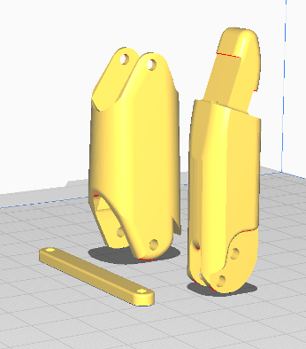
</p>

* **Wrist components**

Take into account that the wrist anterior brace and driving link have a support blocker (shaded gray cube) to prevent the generation of support structures within internal tunnels, which would be impossible to remove.

<p align="center">
  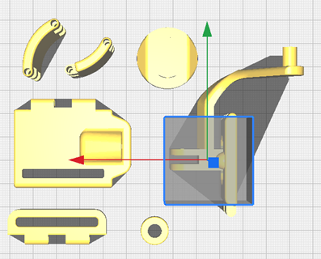
</p>

<p align="center">
  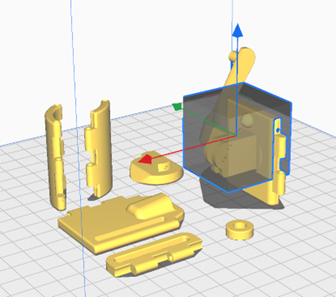
</p>

* **Palm support**
<p align="center">
  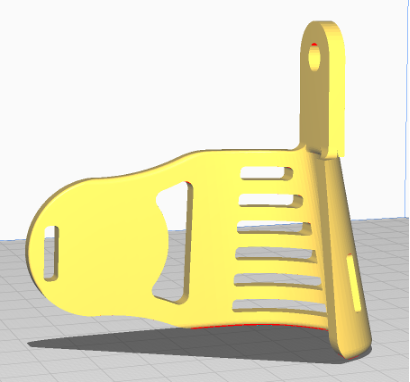
</p>

A 3MF file containing the configurations and positions of the parts is available for rapid manufacturing on the Prusa MK3 printer. The print under the suggested parameters takes approximately 5.5 hours.

## Additional materials
To assemble the bpSRF, the following additional tools and materials are required.

### Tools

* Cutting pliers
* Needle-nose pliers
* Metal File Set
* Soldering iron
* Super glue

### 4. Materials
* 3D-printed components for the bpSRF (as listed in the folder structure)
<p align="center">
  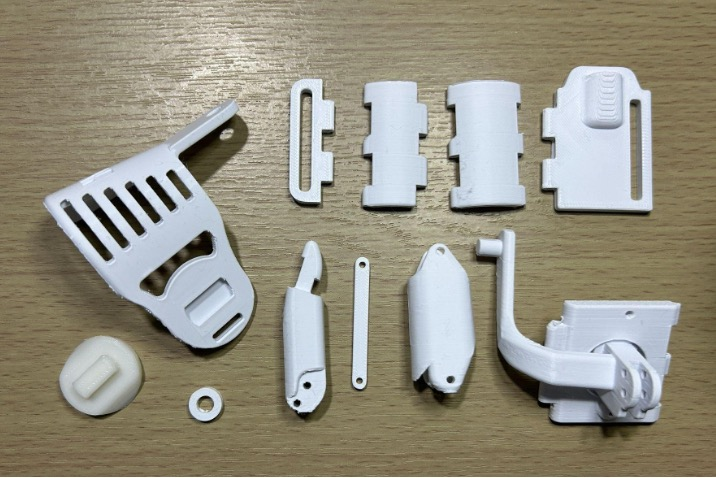
</p>

* Velcro straps:
    * 1.2 cm width and about 21 cm in length
    * 3.5 cm width and about 9 cm in length
* ⌀ 2.5 mm aluminum (or other metal) pins for joints in the following quantities and lengths:
    * 5 x 33 mm
    * 1 x 17 mm
    * 1 x 14 mm
    * 2 x 8 mm
* ⌀ 2 mm elastic wire
* ⌀ 0.25 mm rigid nylon wire
* OPTIONAL: Platinum silicone RTV-A20 A&B (or similar) for the fingertip.

<p align="center">
  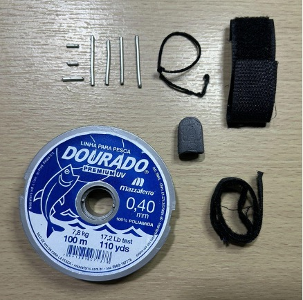
</p>

## Step-by-Step assembly instructions

### 1. Finger

Use the 8 mm pin to secure the inner link to the upper-most axis of the distal phalanx. Then, with the help of a soldering iron, we can slightly melt the plastic around the hole where the pin was inserted to prevent it from slipping out. Any other method to fixate it axially should also work.

<p align="center">
  
</p>

<p align="center">
  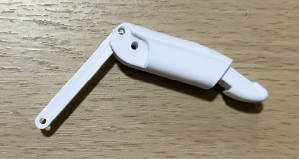
</p>

Then, use the 17 mm pin to connect the distal phalanx with the proximal phalanx. We again ensure they do not slip by using a soldering iron to seal the hole. Another alternative to secure the shafts is to apply a drop of super glue.

<p align="center">
  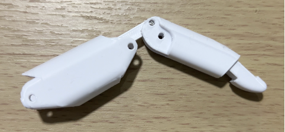
</p>

<p align="center">
  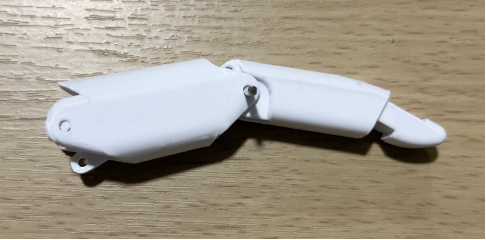
</p>

Once assembled, verify that both phalanges and the inner link slide smoothly against each other, without any significant friction.

Is best to try the assembly without glueing first and, if there was any high friction between surfaces, these should be smoothed using the metal files.

### 2. Wrist bracelet

Next, attach the finger to the wrist using the 17 mm and 8 mm pins. The longer pin joins the proximal phalanx while the shorter connects the inner link to the palm.

<p align="center">
  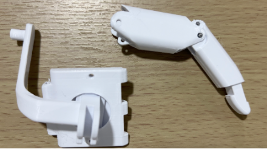
</p>
<p align="center">
  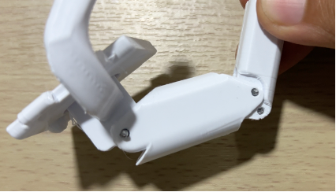
</p>

For the wrist braces, we will use the 33 mm pins. First, we connect the wrist buckle to the wrist anterior brace by passing the pin through the hole located at the bottom of the pieces.

<p align="center">
  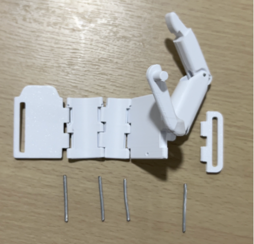
</p>

Before attaching the other wrist braces, pass the rigid nylon wire through the sphere of the wrist anterior brace and through the wrist side brace 1. Then, pass the pin through the hole to connect the wrist side brace 1 to the wrist anterior brace.
Next, add the wrist side brace 2 to the connection by passing the rigid nylon wire through it. Then, pass the pin through the hole to secure it.

Finally, attach the wrist posterior brace to the entire assembly by passing the rigid nylon wire through and securing it with the pin through the hole.

<p align="center">
  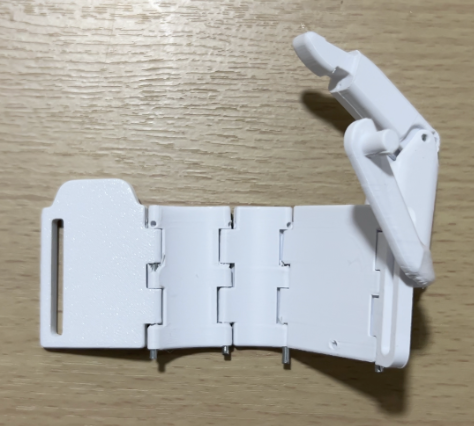
</p>

Using the 3.5 cm Velcro strap, pass it through the hole of the wrist posterior brace and sew it to ensure it is securely fixed.

<p align="center">
  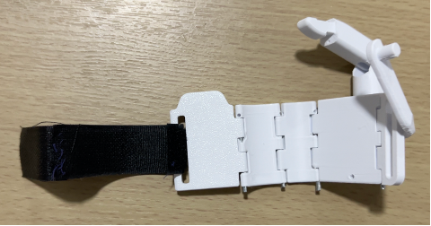
</p>

<p align="center">
  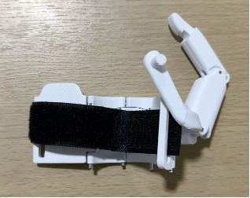
</p>

### 3. Palm support

The palm support holds the cable tensioner for the nylon cable and needs to be fixed to the wrist’s anterior brace.

<p align="center">
  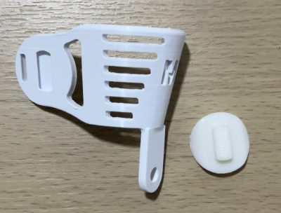
</p>

<p align="center">
  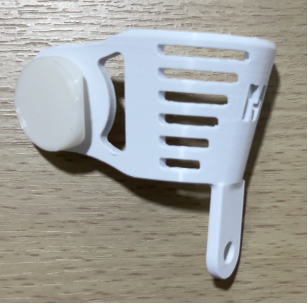
</p>

The shaft collar is placed on the outer surface of the rotational axis of the palm support, to prevent it from moving axially.

<p align="center">
  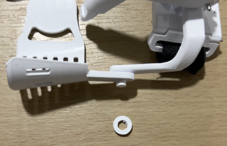
</p>

<p align="center">
  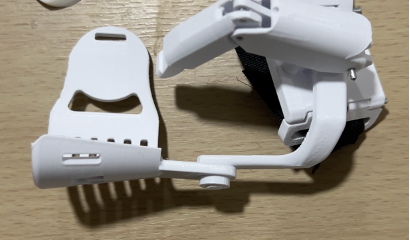
</p>

Using the 1.2cm-width Velcro strap, glue or sew it onto the slot on the side of the palm support to secure that end.

<p align="center">
  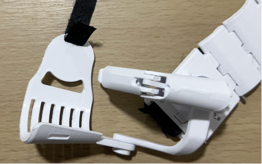
</p>

### 4. Securing the elastic wire

Tie the ⌀2mm elastic wire at the tip of the distal phalanx. Once it is securely tied, we pass it through the upper holes of the distal and proximal phalanx.  
In the wrist anterior brace, you will find a hole through which the elastic wire should be passed and tied to ensure it is secure. The elastic wire should be stretched enough to allow the finger to return to its initial position.

<p align="center">
  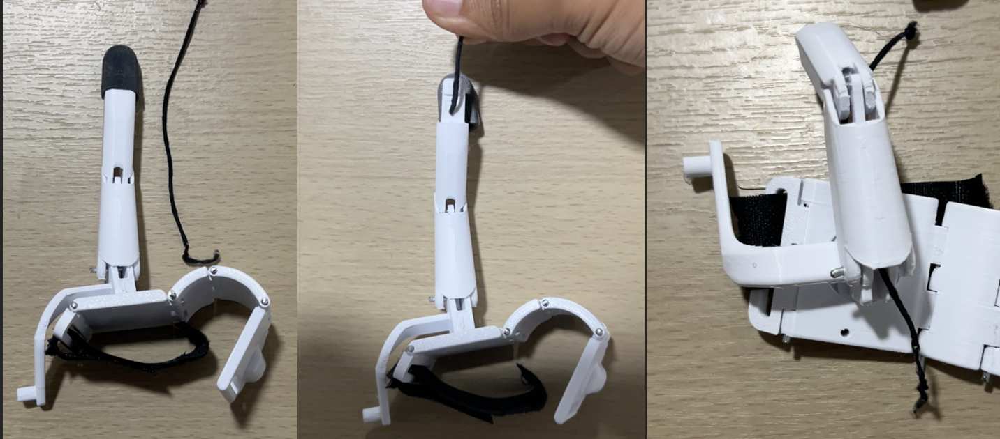
</p>

Similarly, we tie the rigid nylon wire at the tip, then pass it through the lower holes of the distal and proximal phalanx, respectively.

<p align="center">
  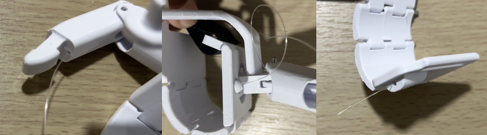
</p>


### 5. Securing the rigid nylon

The ⌀0.25mm rigid nylon wire that drives the finger flexion must be connected to the cable tensioner. Tie it with at least 3 knots to ensure it stays secure. The remaining length between the cable tensioner and the exit point of the nylon wire from the wrist posterior brace should be at least greater than 8 cm. This length depends on the size of the hand.

<p align="center">
  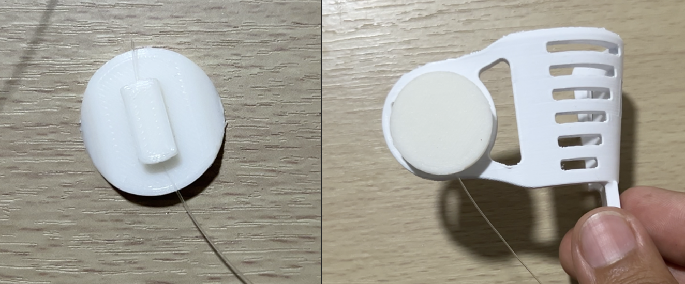
</p>

### Extra: Add a silicon rubber fingertip

The silicone mix is prepared by mixing around 6 grams of both components of the RTV-A20 silicone in a 50/50 ratio. Once mixed, these components will solidify in less than an hour. Note that other liquid silicone rubbers, such as those that use a catalyst for solidifying, would also work.

Using a plastic stick or any similar tool, the silicone is stretched to remove air bubbles and then poured into the mold.

<p align="center">
  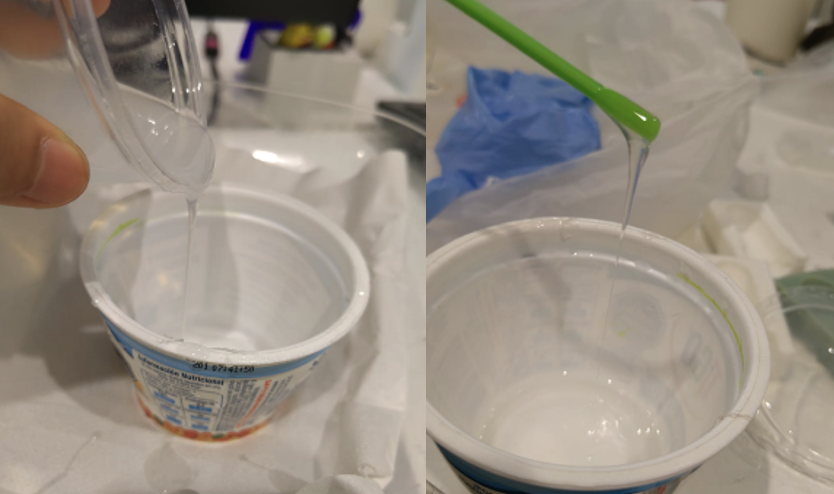
</p>

Both sides of the mold should enclose the mold base, shaped after the SRF's finger. After pouring the material, the parts are secured using zip ties and left to rest for 45 minutes. Finally, the mold is removed, and it is placed onto the finger of the bpSRF.

<p align="center">
  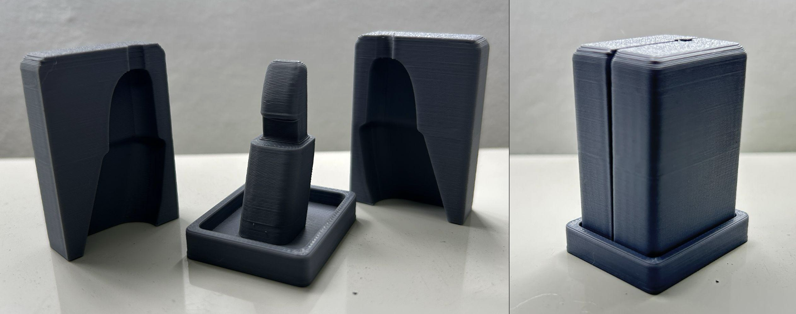
</p>

After solidifying, the fingertip can be removed from the mold. The fingertip should be placed over the top of the finger’s distal phalanx to add compliance and added friction. This helps prevent slipping during object grasping.
<p align="center">
  
</p>

That's it! You can start wearing and trying out the bpSRF. Some cable tensioning or tweaking might still be needed.

## License

This project is licensed under the [Creative Commons Attribution-NonCommercial-ShareAlike 4.0 International License](https://creativecommons.org/licenses/by-nc-sa/4.0/).  
You are free to:
- Share: Copy and redistribute the material in any medium or format.
- Adapt: Remix, transform, and build upon the material.  

**Under the following terms**:
- **Attribution**: You must give appropriate credit, provide a link to the license, and indicate if changes were made.
- **NonCommercial**: You may not use the material for commercial purposes.
- **ShareAlike**: If you remix, transform, or build upon the material, you must distribute your contributions under the same license as the original.

For more details, see the full license text in the `LICENSE` file.
